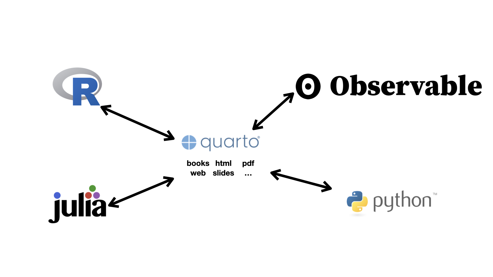

## R


## Quarto



## Functions

### Why write functions?

- If code is copied three or more times, turn it into a function.
- Functions reduce copy-and-paste mistakes.
- When the code changes, it only needs to be updated in one place.
- A clear function name makes code easier to understand and reuse.

### Main parts of a function

```r
function_name <- function(argument, optional_argument = default) {
  result <- argument + optional_argument
  return(result)
}
```

- **Name:** `function_name`
- **Arguments:** the inputs listed inside `function()`.
- **Default:** a value used when an optional argument is not supplied.
- **Body:** the code inside `{}`.
- **Return value:** the output. R returns the last evaluated expression, but
  `return()` makes the output explicit.

### Calling a function

- **By position:** `function_name(2, 4)` depends on argument order.
- **By name:** `function_name(argument = 2, optional_argument = 4)` is clearer.
- An argument with a default value can be omitted.
- Arguments without defaults must be supplied.

### A basic workflow for writing a function

1. Make the code work for one example.
2. Identify which values or variables will change.
3. Turn the changing parts into arguments.
4. Give the function and its arguments informative names.
5. Decide what the function should return.
6. Test normal cases, missing values, and unusual inputs.

### Vector and data-frame functions

- A vector function takes one or more vectors and returns a vector.
- A data-frame function takes a data frame and usually returns a data frame or
  plot.
- Vectorized functions work on every element of a vector.
- `if` checks one logical condition; use `if_else()` or `case_when()` for a
  logical vector.

### Conditional execution

```r
if (condition) {
  # code used when TRUE
} else if (other_condition) {
  # another condition
} else {
  # code used otherwise
}
```

- Conditions are checked from top to bottom.
- `if` requires a single `TRUE` or `FALSE` value.

### Scope and environments

- Objects created inside a function belong to its local environment.
- R first looks for a name inside the function, then in parent environments,
  then in the global environment, and finally in loaded packages.
- A local object can mask an object with the same name outside the function.
- Objects created inside a function are not available outside unless returned.
- Depending on global objects inside a function is risky because changing the
  global object can change the function's result.
- A function should receive the objects it needs through arguments.

### Functions with tidyverse verbs

Tidyverse verbs use tidy evaluation. When an argument represents a column name,
embrace it with `{{ }}`:

```r
group_mean <- function(df, group_var, value_var) {
  df |>
    group_by({{ group_var }}) |>
    summarize(mean = mean({{ value_var }}))
}
```

- Use `{{ variable }}` for one user-supplied column.
- Use `pick({{ variables }})` when the argument may select multiple columns.
- Use `:=` when the name of a newly created variable is supplied or generated
  inside the function.

### Important checks

- Does the function work for all required examples?
- Are missing values handled intentionally with `na.rm` when appropriate?
- Are argument names and defaults clear?
- Does the function depend only on its arguments?
- Is the returned object the correct type and length?
